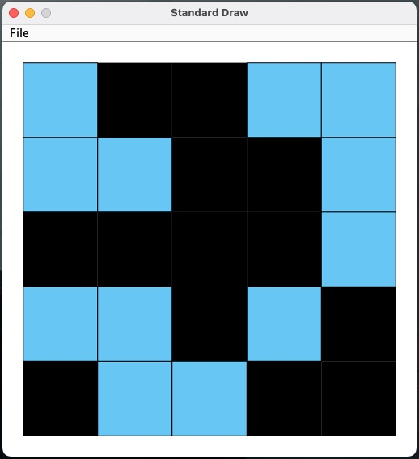
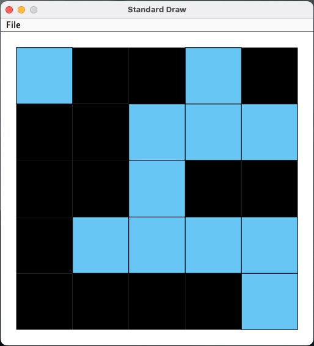

# Percolation
A Java program using the Union-Find data type to determine if connected paths in a system percolate. 

## Summary

Percolation is an application of the Union-Find data type which seeks to solve the dynamic-connectivity problem. Percolation.java creates a "random" n * n grid of sites and determines if their is at least one open site at the top connected to an open site at the bottom (blue for open sites, black for closed sites).

## How to Run

All java files in `src` must be compiled.
Then simply run Percolation.java

## Folder Structure

The workspace contains two folders by default, where:

- `src`: the folder to maintain sources
- `lib`: the folder to maintain dependencies

Compiled output files will be generated in the `bin` folder by default.

  

  

  

  

